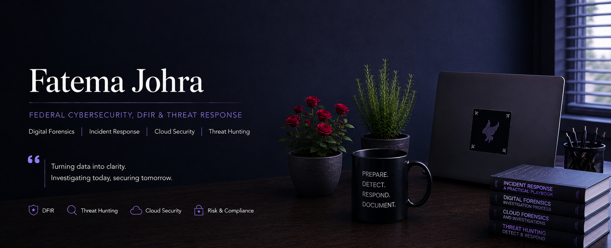

# Cybersecurity Portfolio

## Digital Forensics | Incident Response | Cloud Security

---
Cybersecurity professional specializing in digital forensics, incident response, cloud security investigations, and threat detection across enterprise and federal environments.

This portfolio showcases hands-on cybersecurity projects, incident response workflows, cloud investigation methodologies, forensic analysis techniques, and security operations documentation.

Email: fjohra@hotmail.com  
LinkedIn: https://www.linkedin.com/in/fjohra/

## 🔥 Core Skills

- Incident Response
- Digital Forensics
- Threat Detection
- SIEM Analysis
- AWS & Azure Security
- Threat Hunting
- Documenting aligned with federal standards and compliance

- ## 🛠️ Tools & Technologies

Splunk • Fidelis • AWS • Azure • FTK • EnCase • Magnet Axiom • Wireshark • Cellebrite • Autopsy

## 📂 Featured Projects

### 🔹 Incident Response Playbooks
- IR lifecycle workflows
- Escalation procedures
- Containment strategies
- Executive reporting templates

### 🔹 Business Email Compromise (BEC) Tabletop
- Phishing response simulation
- Credential compromise workflows
- Executive communication procedures

### 🔹 Cloud Security Investigations
- AWS IAM analysis
- Azure authentication anomaly investigations
- Cloud log review and correlation

### 🔹 Digital Forensics Investigations
- Endpoint forensic analysis
- Evidence handling and chain-of-custody
- Mobile and cloud forensic workflows

- ## 🌐 Portfolio Website

https://ftj258.github.io

## 📫 Contact

- LinkedIn: https://linkedin.com/in/fjohra
- GitHub: https://github.com/ftj258
